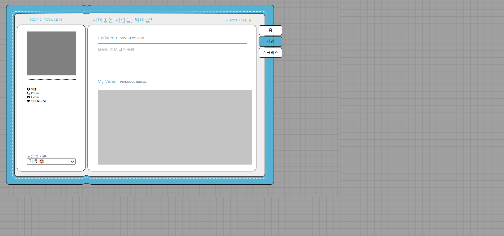
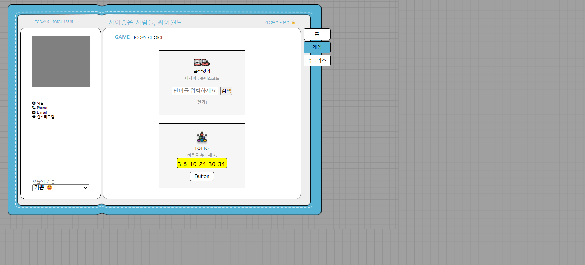

# HTML-CSS-JAVASCRIPT
## 회원가입 레이아웃 실습
### 결과화면

## 싸이월드 만들기

## 싸이월드 레이아웃 배치 결과화면

## 싸이월드 메인페이지 레이아웃 설계
### 결과화면

## 싸이월드 GAME 페이지 레이아웃 설계
### 결과화면

- 끝말잇기 게임 UI 추가
- 로또번호 뽑기 UI 추가
- 홈페이지에 side-button-tab 레이아웃 추가

## 싸이월드 공통으로 사용하는 사이드 버튼 iframe으로 분리
### 결과화면

