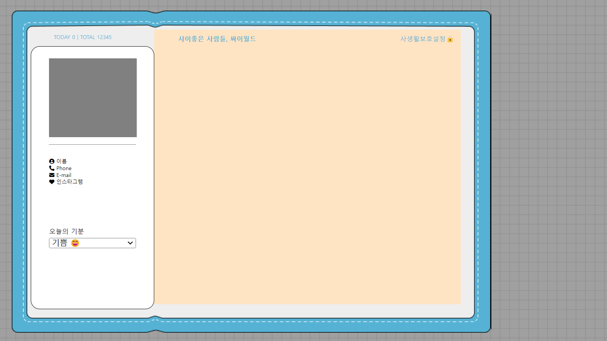
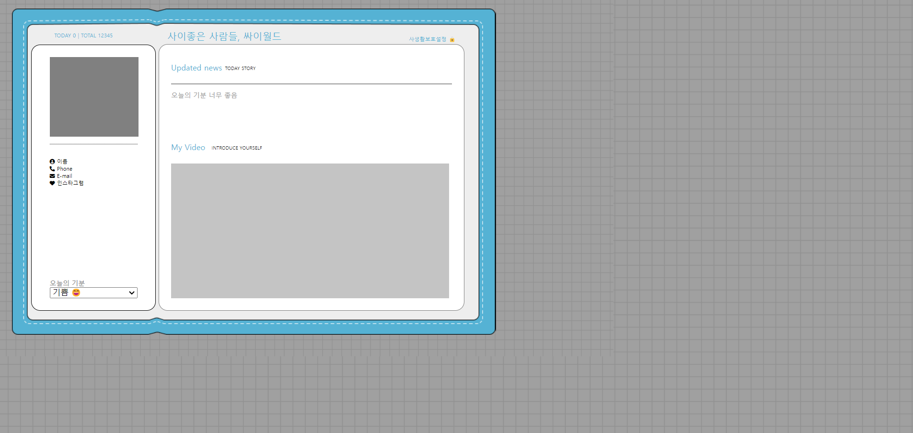
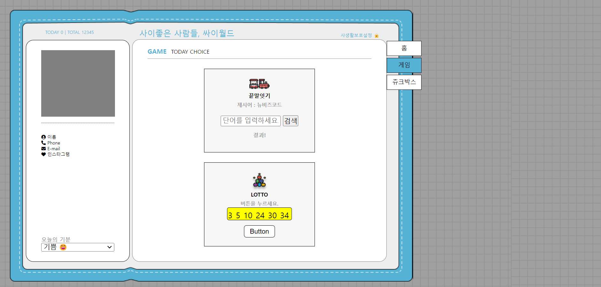

# HTML-CSS-JAVASCRIPT
## 결과화면


## 회원가입 레이아웃 실습
- flex 사용하여 각 div 요소 정렬
- flex-direction과 justify-content를 사용하여 자식요소를 가로축과 세로축을 기준으로 정렬
- box-shadow를 사용하여 그림자 효과 줌
- border-radius를 사용하여 div 모서리를 부드럽게 함


## 싸이월드 만들기

## 싸이월드 레이아웃 배치 결과화면


## 싸이월드 레이아웃 만들기 문제해결 과정과 설명
- flex 사용하여 싸이월드 메인페이지 배치 설계
- flex 사용시 부모 div에 width와 height를 100%로 해두면 자식 div를 정렬할떄 따로 margin또는 padding을 사용하여 정렬을 맞춰주지 않아도 flex-direction과 justify-content만으로 세로방향의 각 영역을 간편하게 정렬할 수 있다
```
.left__body__profile {
    font-size: 9px;
    width: 100%;
    height: 100%;
    /* margin: auto 30px; */
    display: flex;
    flex-direction: column;
    justify-content: flex-start;
    padding-top: 10px;
}

```

```
 <div class="left__body__profile">
    <div class="name">
        <span><i class="fa-sharp fa-solid fa-circle-user"></i></span>
        <span class="profile">이름</span>
    </div>
    <div class="phone">
        <span><i class="fa-sharp fa-solid fa-phone"></i></span>
        <span class="profile">Phone</span>
    </div>
    <div class="email">
        <span><i class="fa-solid fa-envelope"></i></span>
        <span class="profile">E-mail</span>
    </div>
    <div class="instagram">
        <span><i class="fa-sharp fa-solid fa-heart"></i></span>
        <span class="profile">인스타그램</span>
    </div>
 </div>

```


- 이미지를 두개 겹칠때 부모 이미지와 자식 이미지에 postion 속성을 사용하여 겹칠수 있다
- 부모 이미지에 패딩을 줘서 자식 이미지를 이동시키면 더 간편하게 코드를 작성할 수 있다
### 방법1.
```
.background {
    position: relative;
    width : 1024px;
    height: 600px;
    background-image: url('../images/background.png');
}

.outerbox {
    position: absolute;
    width: 808px;
    height: 544px;
    background-image: url('../images/outerbox.png');
    margin-left: 10px;
    margin-top: 20px;
   
}
```

### 방법2.
```
.background {
    width : 1024px;
    height: 600px;
    padding: 20px 0px 0px 20px;
    background-image: url('../images/background.png');
}

.outerbox {
    width: 808px;
    height: 544px;
    background-image: url('../images/outerbox.png');
}


```
## 싸이월드 2일차 메인페이지 레이아웃 설계
### 결과화면


## 싸이월드 3일차 GAME 페이지 레이아웃 설계
### 결과화면

- 끝말잇기 게임 UI 추가
- 로또번호 뽑기 UI 추가
- side-button-tab 레이아웃 설계