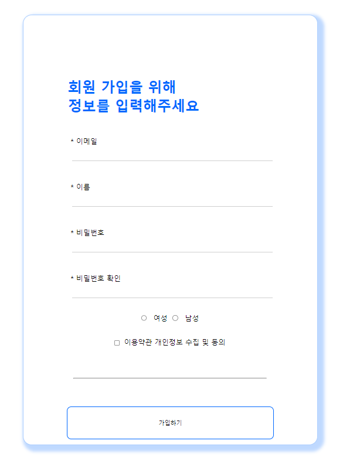
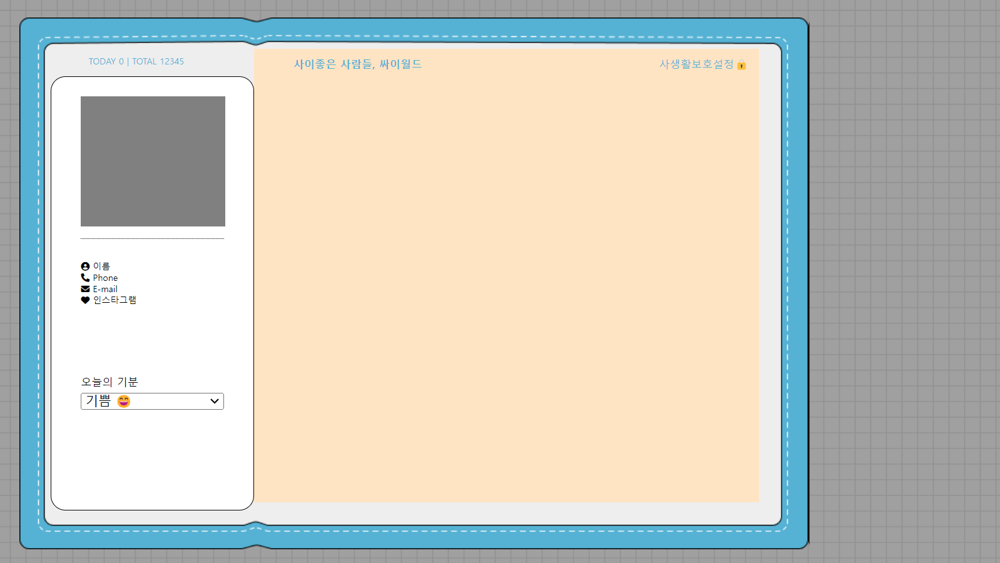
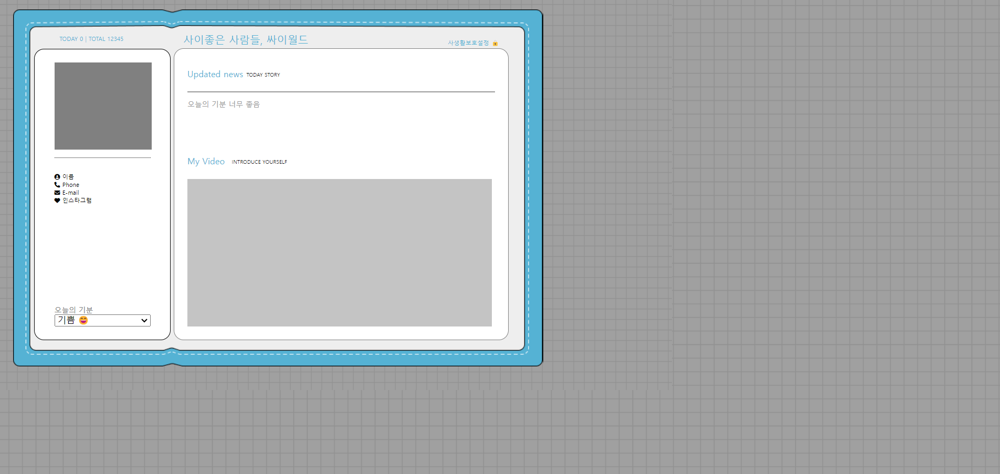
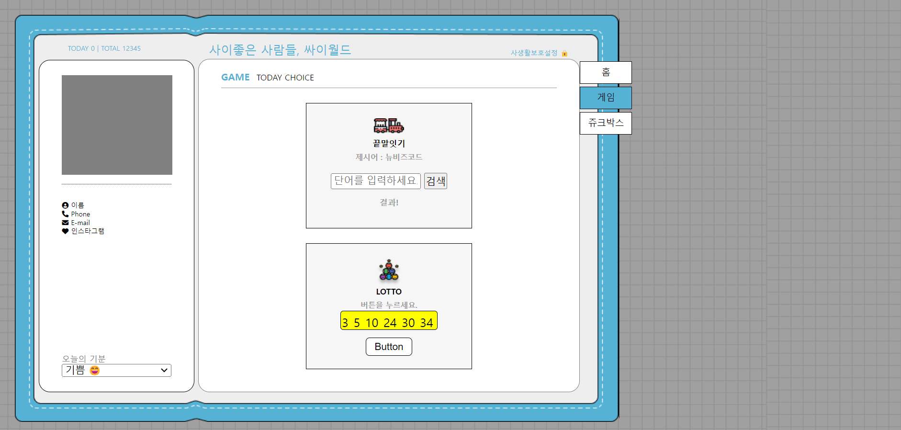
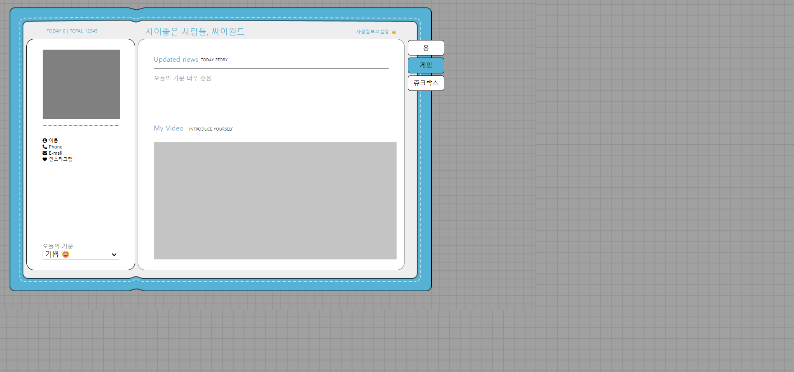
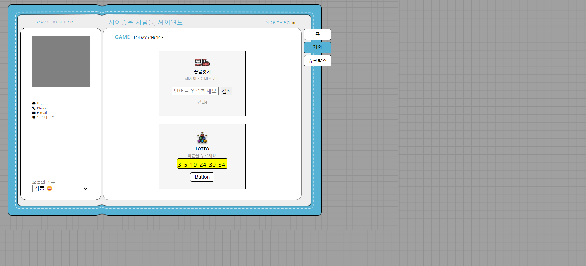
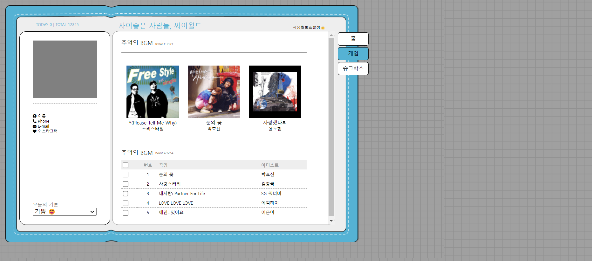

# HTML-CSS-JAVASCRIPT
## 회원가입 레이아웃 실습
### 결과화면

## 싸이월드 만들기

## 싸이월드 레이아웃 배치 결과화면

## 싸이월드 메인페이지 레이아웃 설계
### 결과화면

## 싸이월드 GAME 페이지 레이아웃 설계
### 결과화면

- 끝말잇기 게임 UI 추가
- 로또번호 뽑기 UI 추가
- 홈페이지에 side-button-tab 레이아웃 추가

## 싸이월드 공통으로 사용하는 사이드 버튼 iframe으로 분리
### 결과화면

## 싸이월드 쥬크박스 페이지 레이아웃 설계
### 결과화면

- 추억의 앨범 UI 추가
- 추억의 BGM UI 추가

## 서브메뉴 버튼 클릭시 iframe 변경
- javascript addEventListener 적용
- setAttribute 메서드를 활용하여 각 서브메뉴 버튼 클릭시 div 내부 iframe에 html 파일 변경되도록 설계
- https://github.com/meeyoungchoi-front-dev/pre-codecamp/blob/e3e5500edd3bec691825ec27f62015fa292d23b7/cyworld/script/script.js

## 프로젝트 진행하면서 격은 에러 해결과정 정리
### addEventListener 관련 에러 해결과정
https://github.com/meeyoungchoi-front-dev/pre-codecamp/issues/2
